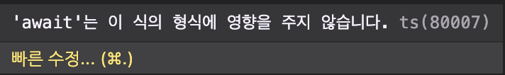
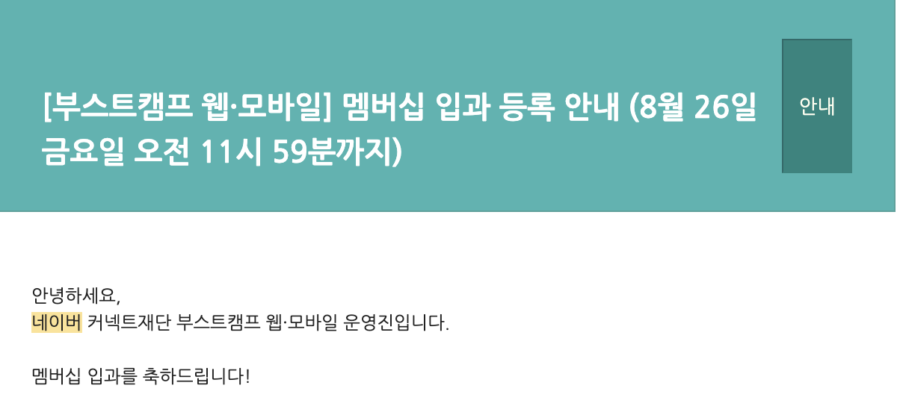

약 5달간의 여정이 끝났다. 웹에 관해 아는 것이 전혀 없던 내가 어떻게 두려움도 없이 이 곳에 올 선택을 할 수 있었을까. 부스트캠프에 지원하기로 했던 결심은 내 개발 인생에서 가장 크고 긍정적인 변화를 줬다.

 

# 부스트캠프 이전의 나

나는 그냥 컴퓨터공학과를 다니던 평범한 전공생이었다. 컴퓨터공학이 좋아서 오긴 했으나, 고등학교 생활의 보상심리였을까 대학교에서의 공부를 그닥 밀도 있게 하지는 않았다. 즐겁게 공부하긴 했지만 사실 열을 다해서 하진 않았으며, 딱 뒤쳐지지 않은 정도였다. 그렇게 무기력하게 학교를 다니다 진로를 정해야할 때가 되었고, `System Programming`수업과 `DB`수업을 흥미롭게 듣던 나는 얼떨결에 백엔드 개발자가 되기로 결심했다.

> 우선 웹에 대해서 배워보자!

 

# 부스트캠프 과정의 나

우선 웹에 대해서 공부하기로 하고 부스트캠프에 지원했다. 두 차례의 코딩 테스트를 통해 선발이 되었는데, 이는 다행히도 1,2월쯤 들었던 `삼성전자 DX부문 동계 대학생 S/W 알고리즘 역량 강화 특강`의 덕이 컸다. 이 후 챌린지 기간을 거치며 **<u>기초 CS 지식 심화학습 및 분야별 도메인 지식 학습</u>**을 진행했는데, 이 과정이 근래에 가장 힘들었던 기간인 것 같다.

 

## 챌린지

_2022.07.18~08.12_

챌린지 기간엔 웹을 공부하기 이전에 관련 도메인 지식을 학습했다. 어떤 건 학교에서 배울 수 있는 내용이었지만, 학교에서 배울 수 없던 것들 또한 있었다. 무기력함이 떨쳐질 정도로 재미있었으며, 별개로 나의 부족한 점을 채워나가느라 이 기간 동안 거의 매일을 새벽 4,5시쯤 잤다.

이 때 나는 javascript를 처음 써봤다. 내 개발 인생 99%를 C와 python(잠깐)만 써오다가 javascript를 처음 써봤는데, 비동기라는 개념이 나를 엄청 괴롭혔다. 이는 내게 그동안 접해보지 못했던 개념이었으며 처음에 적응하기까지 너무 어려웠다.

🙀

사실 근데 비동기라는 것은 Javascript의 꽃이다. 익숙해진 지금은 너무 당연한 것들이 당시엔 왜 저리 어려웠는지….

 

## 멤버십

_2022.08.31~12.16_

내 밤샘 노력이 결국 멤버십 합격으로 결실을 맺었다.

챌린지 때 너무 두들겨 맞았어서 멤버십 때는 좀 강해져서 돌아가고 싶었다. 그래서 진~짜 안 읽던 책도 몇권 사고 `모던 자바스크립트 Deep Dive`를 열심히 읽고 정리했다. 난 내가 강해졌다고 생각했다.

그러나 한 주, 한 주 지나가며 지식이 많아질 수록 모르는 건 더 많아졌다. 알면 알수록 내 위치가 더 적나라하게 드러났다. 백엔드를 지망한다고 했으면서 프론트엔드를 지망하시는 분들 보다 서버에 대해 훨씬 무지했으며, 이런 내가 화가났다. 한 3주차 쯤인가 당시에 가장 두려워하던 요청을 받았다.

> 성준님~ 코드 리뷰 좀 해주실 수 있나요?

🙀🙀

저 초반 1주차~4주차 정도엔 자괴감에 빠져 살았다. 약간 축구선수가 공이 내게 오지 않았으면 하는 슬럼프에 빠진 느낌… 이를 극복하기 까지는 꽤 많은 밤과 동료들이 필요했다. 중간에 동료들과 `오순도순`이라는 팀을 만들어 `SleepyWoods`라는 웹 서비스를 개발했는데, 이 동료들 덕분에 정말 많이 성장한 것 같다. 팀원들은 어떻게 생각할지 몰라도 난 정말 회의중독이었다.

<a href="https://sleepywoods.kr/" target="_blank">~~SleepyWoods 방문하기~~</a>
{: .mx-auto.d-block :}

 

# 부스트캠프 이후의 나

부스트캠프의 슬로건은 다음과 같다.

> 개발자의 지속 가능한 성장을 위한 학습 커뮤니티

처음엔 위의 뜻을 잘 이해하지 못했다. 사전적인 의미 이상으로 와닿지는 않는 문장이었다. 그러나 부스트캠프를 수료한 지금은 저 문장이 지난 5달을 완벽히 요약한 문장이라고 생각된다. 학습은 혼자 집에서도 할 수 있다. 이제와서 남은 것이 무엇이냐 생각해보면, 지식이 아니라 언제든 같이 지식을 학습할 수 있는 커뮤니티 아니었을까. 열심히 하는 사람들 사이에 있으면 나도 자극받는다. ~~운동을 잘 안 가는 나도 막상 헬스장에 가면 열심히 하는 그런 느낌?~~

정말 많은 것을 느낀 경험이었으며, 만약 누군가가 추천하는 지 묻는다면 나는 무조건 추천한다. 특히 본인이 무기력함에 빠졌을 때는 더욱!

지속 성장 가능한 개발자가 되기 위해 몇 가지 나만의 rule을 정해보자

**1. 혼자 앓지 말고, 주변 동료들을 잘 활용하자.** 
**2. 기술 공유를 두려워하지 말자. 뭐든지 문서화하자.** 
**3. 결정을 내리는 데 있어 타당한 이유를 댈 수 있어야한다.** 
**4. 다른 사람을 나와 비교하고, 자책하지 말자. 내 시간은 온다.** 
