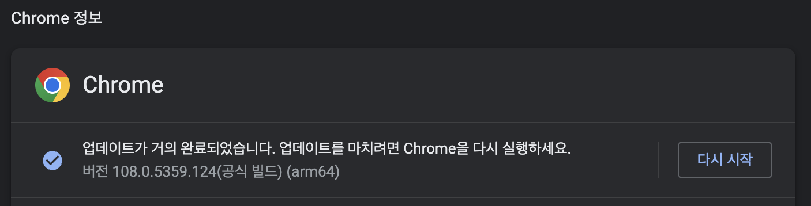
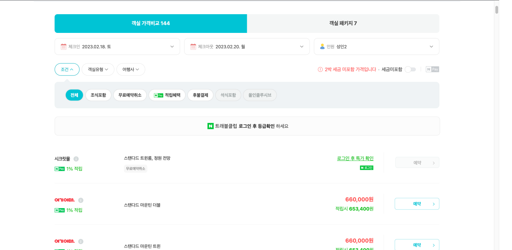
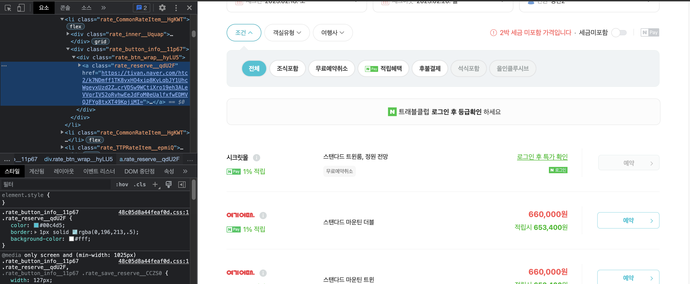
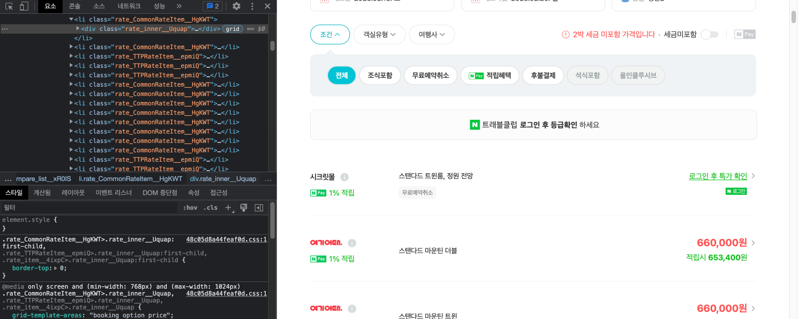

회사에서 필요한 데이터를 수집 및 가공하는 과정에서 python으로 크롤링을 하게된 적이 있었다. 이 때 다양한 문제들을 접할 수 있었는데, 그 과정에서 얻어낸 정보들을 정리하기로 결심했다.

> ⚠️ 해당 사이트가 정보 수집에 관하여 열려있는 지 우선 확인하자. robots.txt를 참조하면 해당 사이트의 정책 및 권한을 확인할 수 있다. 또한 잦은 크롤링은 해당 서비스에 부하를 줄 수 있으므로 내가 찾으려는 정보가 API 식으로 제공이 되는 지 또한 확인해보자.

<br>

# 크롤링 준비

크롤링을 하기 전에 환경을 먼저 구성하자. 본인의 크롤링 상황에 적합한 라이브러리를 선택하고 확장성을 고려하자.

<br>

## 가상 환경 VS 로컬

---

반드시 가상 환경에서 크롤링을 진행할 필요는 없다. 그렇지만 필자는 다음과 같은 이유로 크롤링을 위한 가상 환경을 준비한다.

- 크롤링을 하는 동안, 다른 작업을 하기 껄끄러울 수 있다.
  - 이전에 처리해야할 데이터가 너무 많아 로컬에서 `Multi-Processing`을 진행했더니, 다른 작업을 하기 어려웠다.
- 프로젝트 의존성 같은 걸 고려하지 않아도 된다.
  - 혹 나 말고도 다른 팀원들이 사용할 코드라면, 가상 환경에 프로젝트를 설정해두는 것이 사용에 편리할 수 있다.
- ~~혹 접근이 차단될 수도 있다…~~

필자는 여러 크롤링 과정에서 다음과 같은 도구들을 활용했다.

- Google Colab
  - 구글에서 제공하는 도구로 `Jupyter Notebook` 실행을 위한 가상 환경을 제공한다. 무료로 이용할 수 있으며 약간 불편한 점도 있으나, 본인의 프로젝트가 간단한 것이라면 `Colab` 또한 좋은 접근성과 편리성을 제공한다.
- Cloud Server
  - 마침 Naver Cloud에 남은 credit이 있어 서버 인스턴스를 열어 크롤링을 한 적이 있다. 당시에 시간 요금제로 짧고 굵게 크롤링을 할 수 있었다.

<br>

## Selenium

---

크롤링 방법들을 찾아보다 보면 매우 자주 보이는 라이브러리이다. `Selenium`은 웹 어플리케이션을 테스트하기 위한 자동화 도구라고 한다. 그렇지만 크롤링에 있어 매우 유용한 라이브러리다.

<br>

### Selenium의 필요성

만약 크롤링하려는 페이지가 단순히 정적 HTML을 제공한다던가, 내가 원하는 정보가 해당 페이지의 HTML에 직접적으로 적혀 있다면 `Selenium`을 사용할 필요가 없다. 그렇다면 `BeautifulSoup` 과 같은 HTML Parsing 라이브러리를 통해 더 쉽고 빠르게 정보를 가져올 수 있다.

그치만 대부분의 경우엔 내가 수집하려는 정보가 비동기로 호출되거나, 특정 인터랙션을 통해 생성되는 정보일 것이다. 그렇다면 단순히 해당 페이지의 HTML을 가져오는 것으로는 정보를 추출할 수 없다.

이럴 때 사용되는 라이브러리가 `Selenium`이며, `Selenium`을 통해 브라우저를 마치 내가 직접 사이트를 이용하는 것 처럼 인간적이게(?) 크롤링을 시킬 수 있다.

<br>

### Selenium 준비

우선 `Selenium`으로 구동시킬 브라우저를 준비하자. 나는 이번 프로젝트에 Chrome 브라우저를 사용했으며, 해당 브라우저를 구동시킬 드라이버 또한 다운 받았다. 브라우저 버전과 드라이버의 버전이 일치해야 한다.

- Chrome 버전 확인
  - Chrome → 설정 → Chrome 정보 탭



- Chrome 드라이버 다운
  [ChromeDriver - WebDriver for Chrome - Downloads](https://chromedriver.chromium.org/downloads)
  프로젝트의 폴더에 해당 드라이버를 넣어주자

pip를 통해 python에서 `Selenium`을 쓸 수 있도록 설치하자

- `Selenium` 설치
  `pip install Selenium`

<br>
<br>

# 크롤링 시작

준비를 마쳤다면 본격적으로 크롤링을 시작해보자.

## Selenium 시작

---

우선 `Selenium`으로 브라우저를 구동 시켜보자. 확장성을 고려하여 함수를 선언해 호출하자. 모든 코드는 python으로 작성되었다.

```python
from selenium import webdriver

def openBrowser():
  driverOptions = webdriver.ChromeOptions()
  # driverOptions.add_argument('headless') # 브라우저를 띄우지 않고 실행. linux라면 필수.
  # driverOptions.add_argument('disable-gpu') # GPU 사용 안하도록 설정
  # driverOptions.add_argument('--no-sandbox')
  driverOptions.add_argument('lang=ko_KR') # 언어 설정
  driverOptions.add_argument('--disable-dev-shm-usage') # 공유 메모리를 담당하는 디렉토리를 사용하지 않겠다는 의미이다.
  driverOptions.add_argument('window-size=1920,1080') # 브라우저의 크기를 설정
  driver = webdriver.Chrome('chromedriver', options=driverOptions)
return driver

def crawling():
  driver = openBrowser()
  .
  .
  .
  driver.close()

crawling()
```

주석을 친 부분은 `headless` 모드로 구동시킬 때 필요한 option들이다. Linux와 같은 환경에서는 GUI를 지원하지 않기 때문에 `headless` 모드로 해줘야 한다. `headless` 모드를 사용하면 백그라운드로 실행되기 때문에 다른 작업과 병행할 수 있다. 그치만 내가 느낀 `headless` 모드의 단점 또한 있기 때문에 나는 되도록 `headless` 모드를 지양한다. 이는 아래에서 따로 설명하겠다.

`driver.close()` 를 통해 driver를 종료할 수 있는데, 프로그램이 다 끝났다면 무조건 해주자. 컴퓨터에 종료되지 않은 chrome 들이 리소스를 잡아먹고 있을 수 있다.

<br>

### 페이지 접근

위에서 설정해준대로 코드를 돌리면 브라우저가 잠깐 켜졌다가 꺼질 것이다. (아직 구현한 코드가 없어서)
크롤링하는 페이지에 접근하려면 다음과 같이 하면 된다.

```python
def crawling():
  driver = openBrowser()
  driver.get(url)
  driver.implicitly_wait(10)
  .
  .
  .
  driver.close()
```

- `driver.get(url)`
  - 브라우저를 해당 url에 접근하도록 한다.
- `driver.implicitly_wait(sec)`
  - 브라우저를 해당 페이지로 이동 시킨 후, 페이지가 로딩될 때 까지 최대 `sec`(초) 만큼 기다린다.
  - 해당 페이지에 접근하자마자 요소를 긁어오려 한다면 아직 정보가 다 불려오지 않아 실패할 수 있다. 비동기 정보들을 올바르게 가져오기 위해선 꼭 위와 같이 기다려주자.
  - 다양한 종류의 `wait`들이 존재한다. `implicitly_wait()` 은 유연한 `wait`을 제공하여 비교적 좋은 성능을 낼 수 있다.
  - 한 번만 선언해도 모든 브라우저의 동작에 적용된다. 중복해서 사용하지 않아도 된다.

<br>

### 해당 페이지에서 찾으려는 요소 탐색

개발자모드를 켜서 찾으려는 요소의 `ID`, `CLASS`, `XPATH` 등을 찾아오자. 본인이 가져오려는 정보에 맞춰 적절한 방식을 취하자. 탐색은 다음과 같이 구현된다.

```python
from selenium.webdriver.common.by import By

def crawling():
  driver = openBrowser()
  driver.get(url)
  driver.implicitly_wait(10)

  targetList = driver.find_elements(By.CLASS_NAME,"클래스 이름")
  # targetList = driver.find_elements(By.ID,"ID 이름")
  # targetList = driver.find_elements(By.TAG_NAME,"태그 이름")
  # targetList = driver.find_elements(By.XPATH,"XPATH")

  driver.close()
```

`find_elements()`는 조건에 맞는 모든 요소들을 배열 형식으로 가져온다. 따라서 특정 Link를 불러오려고 할 때, `find_elements(By.TAG_NAME, “a”)` 와 같은 식으로 하다간 해당 페이지의 모든 `a` 태그를 불러올 것이다.

조금 더 구체적인 방식으로 원하는 요소만 골라보자. `XPATH`를 활용해도 되고 다음과 같이 여러번 물려서 사용할 수도 있다.

```python
target = driver.find_element(By.CLASS_NAME,"클래스 이름") # 예시를 위해 find_element를 통해 하나만 불러왔다.
link = target.find_element(By.TAG_NAME, "a").get_attribute("href")
```

- target의 하위 요소들을 탐색하여 `a` 태그 요소를 찾고, 해당 요소의 `href` 속성값을 불러와 원하는 link를 불러올 수 있다.

`Selenium`의 문법은 구글링하면 잘 나와있다. 참고해보자.

<br>
<br>

# Multi-Processing

사실 `Multi-Processing` 까지 해야할 필요는 없을 수 있다. 그러나 회사 규모의 큰 집단에서 다루는 데이터들은 보통 양이 많다. 이전에 받은 크롤링 업무에서 처리해야할 데이터가 약 2만 개 정도였다. `Selenium` 으로 페이지 이동을 하면서 한 데이터를 처리하는데 10~30초 정도 걸렸는데, 싱글 쓰레드로 2만 개 정도를 계산해보니 950 시간 정도가 걸렸던 것 같다. `Multi-Processing`이 간절히 필요했다

<br>

## multiprocessing

---

파이썬에선 `multiprocessing` 라이브러리가 있으며 다음과 같이 쉽게 일을 분배할 수 있다.

```python
import multiprocessing

if __name__ == '__main__':
  works = get_count("처리할 데이터 수", "쓰레드 수") # 전체 데이터를 쓰레드 수에 맞게 분배

  manager = multiprocessing.Manager() # 쓰레드간 메모리 공유를 위한 manager
  returnList = manager.list() # 각 쓰레드가 각자한 일을 returnList에 append

  for count in works: # crawling 함수를 수행할 process 생성
    p = multiprocessing.Process(target=crawling, args=(returnList))
    process.append(p)
    p.start() # process 시작

  for p in process:
    p.join() # process가 종료될 때 까지 기다린다. 해주지 않고 프로그램이 종료되면 좀비 프로세스가 생길 수 있다.
	.
	.
	.
```

`if __name__ == ‘__main__’:` 은 뭘까?

찾아봤더니 파이썬에서는 각 프로세스들이 내부적으로 `__name__` 값을 갖는다. 즉 우리가 실행시킨 메인 프로그램은 `__name__` 값으로 `__main__` 값을 가지나, 그로 인해 생성된 자식 프로세스들은 `__name__ == ‘__main__’` 가 False가 된다. 자식 프로세스들이 process를 무한정으로 재생산 하면 안되므로 위와 같이 보호(?) 해주자.

본인의 크롤링 작업과 환경에 맞게 알맞게 `multi-processing`을 해주자!
필자는 8개의 쓰레드 까지는 효율이 잘 나왔으나, 16개로 쓰레드를 올리니 효율이 극 나빠졌다.

- 16 works / 8 workers : 4분 \* 2 = 8분
- 16 works / 16 workers : 12분

학교에서 C로 `multi-processing` 프로젝트를 했을 때는 32, 64개 정도의 worker process들을 생성하는 것이 sweet spot이었던 것 같은데, 네트워크 탓인지 `Selenium`이나 chrome의 탓인지 8개가 최고효율이었다.

그렇게 window server를 4개 파서 약 2만 개의 데이터를 660분 정도에 처리할 수 있었다.

950 시간 → 11 시간

<br>
<br>

# 트러블 슈팅

크롤링을 하면서 다양한 이슈들이 있었다. Google에 은근 `Selenium`에 관한 정보들이 파편화 되어 있고 명확하게 없어서 기록해보기로 했다.

<br>

## 분명 개발자 도구에서는 보이는 데 find 가 안될 때 1 : iframe

---

네이버 카페에 필요한 데이터가 있어 크롤링한 적이 있다. 게시글 목록을 불러오려 했는데 자꾸 빈 배열이 반환되었다.

내가 요소를 잘못 검색한 것인가 해서 `find_elements()` 로 상위 요소들을 한 depth씩 타고 올라갔다. 그러자 특정 부분에 변곡점(?)이 있었는데, 그게 `iframe` 태그였다.

<br>

### iframe 이란?

[MDN : 인라인 프레임 요소](https://developer.mozilla.org/ko/docs/Web/HTML/Element/iframe)

현재의 HTML 내에 다른 HTML 페이지를 `inline`으로 삽입할 수 있도록 도와주는 Tag이다.

네이버 카페의 게시글 목록 부분은 iframe 태그로 다른 HTML을 불러와 내장시킨 구조였다. 즉 해당 부분은 다른 페이지라고 볼 수 있는 것이다.

<br>

### Selenium에서 iframe 페이지를 접근 하는 법

다음과 같이 `iframe` 페이지에 driver를 접근시킬 수 있다.

```python
def switchToIframeById(iframeId):
  iframe = driver.find_element(By.ID, iframeId)
  driver.switch_to.frame(iframe)
```

이 후 driver에서 `find_elements()` 를 통해 하위 요소들을 탐색할 수 있다.

<br>

## 분명 개발자 도구에서는 보이는 데 find가 안될 때 2 : window-size

---

네이버 호텔 페이지에서 `Selenium`을 써본 적이 있었다.



1. 원하는 호텔과 날짜를 선택하여 검색한 후
2. 가격 비교 탭의 회사별 상품 목록들을 보고
3. 예약 버튼을 누르도록

했는데 예약 버튼이 눌리지 않았다. 개발자 도구에서도 보이고 내 눈에도 보이는 데 `Selenium`이 이를 가져오지 못했다. 혹시 `Selenium` 탓인가 해서 `BeautifulSoup`을 통해 시도했는데, 이 또한 실패했다.

이걸로 1,2 시간은 삽질했으려나, 개발자 도구를 아래에서 옆으로 옮기다가 답을 알아냈다.



개발자 도구를 더 늘렸더니 예약 버튼이 사라졌다.



네이버 호텔 페이지의 예약 버튼은 반응형으로 페이지의 크기에 따라 생성되는 방식이었나보다. 즉 브라우저가 작게 띄워져 있거나 `headless` 모드로 실행되었다면 해당 요소를 찾을 수 없다.

<br>

### Selenium의 브라우저 크기 조절

아까의 driver options들을 보자

```python
from selenium import webdriver

def openBrowser():
  driverOptions = webdriver.ChromeOptions()
  # driverOptions.add_argument('headless') # 브라우저를 띄우지 않고 실행. linux라면 필수.
  # driverOptions.add_argument('disable-gpu') # GPU 사용 안하도록 설정
  # driverOptions.add_argument('--no-sandbox') # 공유 메모리를 담당하는 디렉토리를 사용하지 않겠다는 의미이다.
  driverOptions.add_argument('lang=ko_KR') # 언어 설정
  driverOptions.add_argument('--disable-dev-shm-usage') # 공유 메모리를 담당하는 디렉토리를 사용하지 않겠다는 의미이다.
  driverOptions.add_argument('window-size=1920,1080') # 브라우저의 크기를 설정
  driver = webdriver.Chrome('chromedriver', options=driverOptions)
return driver
```

글 앞 부분에서 나는 되도록 `headless`를 지양한다고 했는데, 이는 이런 이유에서였다. 만약 `headless`를 해서 잘 나온다면 상관없지만, ~~잘 안된다면 `headless` 모드를 해제하고~~ `window-size`를 조절해보자.

> <b>🔧 headless 모드여도 window-size를 조절하면 위와 같은 상황에서 원하는 요소에 접근할 수 있다고 한다. </b>

**다양한 크기 조절 options**

- 크기 지정
  - `add_argument('--window-size= x, y')`
- 최대화
  - `add_argument('--start-maximized')`
- 풀스크린 (F11)
  - `add_argument('--start-fullscreen')`

<br>
<br>

# 참조

---

[MDN : 인라인 프레임 요소](https://developer.mozilla.org/ko/docs/Web/HTML/Element/iframe)
