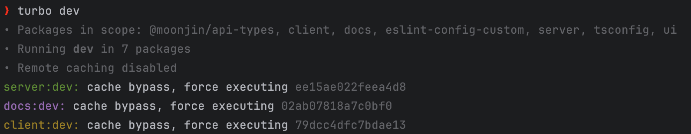

## 모노레포를 결정한 이유
### 기존의 불편함
현재 문진 웹서비스의 개발 팀원은 백엔드 개발자인 나와 프론트엔드 개발자인 윤하님 두명으로 구성되어 있다.
기존에 같이 토이 프로젝트를 진행하면서 백엔드와 프론트엔드를 분리하여 개발했었는데, 다음과 같은 불편한 점들이 있었다.
- 서로의 **코드가 따로 관리**되어 피드백을 주고받는 과정이 매우 번거롭다.
- API를 주고 받을 때 input, output 의 형식을 각자 관리 해야하는데, 이는 **비효율적이면서 불일치**가 발생할 수 있다.
- 같이 사용할 수 있는 **코드들을 공유하기가 어렵다**.

사실 셋 다 비슷한 맥락의 불편함인데, 토이 프로젝트를 진행하며 위와 같은 내용들에 관해 자주 대화를 했었다. 
문진 웹서비스 개발을 새로 시작하면서 위의 부분을 모노레포로 개선할 수 있지 않을까 생각했으며,
마침 프론트와 백엔드 둘 다 Typescript 기반이라는 점에서 모노레포가 가져올 장점이 매력적이게 다가왔다. 

<br>

### 모노레포의 장점
모노레포는 여러 프로젝트를 하나의 레포지토리에서 관리하는 것을 의미한다.
흔히 알려진 교과서적인 장점 말고 직접 프로젝트에 도입하면서 느낀 장점은 다음과 같았다. 

##### 1. 서로의 코드를 쉽게 공유할 수 있으며, 피드백을 주고 받기가 편하다.
아직 서버 배포가 이뤄지지 않은 상황에서 윤하님은 로컬에서 개발을 진행할 때, 서버를 띄워두고 테스트를 진행한다.
모노레포 환경에선 서버와 클라이언트를 동시에 띄워두고 개발을 진행하는 데 더 수월하며,
문제가 생겼을 시 어느 부분에서의 문제인지 조금 더 자세히 알 수 있었다.<br>
<u>프론트 개발자가 개발 시 서버의 동작을 이해하야 하나?</u> 는 분명 아닐 수 있지만,
서로의 영역을 어느 정도 이해하고 있는 우리 개발팀의 입장에서는 이러한 점이 생산성에 도움이 되었다.

##### 2. API의 input, output 형식을 공유할 수 있다.
토이 프로젝트를 진행하면서 항상 불편했던 부분은 API를 만들었을 때, 문서 기반의 의사소통을 한다는 점이며
해당 API 문서를 통해 각자가 필요한 데이터를 관리해야 한다는 점이었다. <br>
모노레포에선 해당 부분을 공통 `packages`로 추출하여 공유하는 식으로 개선할 수 있으며, 이는 한쪽에서
**수정 사항이 발생했을 시, 다른 쪽에서 런타임이 아닌 빌드 시간에 변경점을 파악할 수 있다는 것**이 큰 장점이다.

##### 3. 코드 및 lint, prettier 등의 설정을 공유할 수 있다.
코드 컨벤션 통일을 위해 `lint`, `prettier` 등의 설정을 다양한 앱에서 공유할 수 있다는 점 또한 장점이다.
통일된 코드 컨벤션은 서로의 코드를 봐야할 떄도 빛을 발한다. 또한 중복되는 코드들을 `packages`로 공유할 수 있어 좋았다.

##### 4. 확장성
`lint`, `prettier` 등의 설정 파일과 다양한 유틸 함수가 쉽게 제공되고 있는 모노레포에서, 
새로운 프로젝트를 생성할 때 굉장히 편리하다. 따라서 확장성이 좋다고 생각했다. <br>

이외에도 다양한 모노레포의 장점이 있으며, 위의 내가 말한 장점이 누군가에겐 다른 방식으로 해결될 수 있는 
작은 부분일 수 있지만, 우리의 입장에서는 모노레포를 도입하기로 결정하는 데 매력적인 요인이 되었다.

<br><br>

## Turborepo를 활용한 모노레포 적용

### Turborepo란?
> Turborepo는 JavaScript와 TypeScript 코드 베이스의 모노레포를 위한 고성능 빌드 시스템이다.

Turborepo를 구성하는 방법이나 동작 원리 등은 아래의 더 훌륭한 자료들을 참고하면 좋을 것 같다.
- [Turborepo 공식 문서](https://turborepo.org/)
- [Turborepo로 모노레포 개발 경험 향상하기](https://engineering.linecorp.com/ko/blog/monorepo-with-turborepo)
<br>

### 프로젝트에 Turborepo 적용하기
현재 문진 웹서비스 프로젝트는 다음과 같은 기술 스택으로 계획했다.
- 프론트엔드 : `Next.js`
- 백엔드 : `Nest.js`

해당 서비스는 SEO가 매우 중요하기 때문에 프론트엔드를 `Next.js`를 사용하게 되었고,
백엔드는 같은 Typescript 기반의 `Nest.js`를 사용하기로 했다. 

#### 프로젝트 생성
먼저 아래의 공식 문서를 보면서 `turborepo`를 설치하고, 프로젝트를 생성해보자.
- [프로젝트 생성하기](https://turbo.build/repo/docs/getting-started/create-new)

위와 같이 프로젝트를 생성하면 root에 아래와 같은 폴더 구조가 생긴다.
```bash
apps
    ├── docs
    └── web
packages
    ├── eslint-config-custom
    ├── tsconfig
    └── ui
.
.
```
apps는 실제 응용이 담기는 부분이라 보면되고, packages는 공통으로 사용되는 코드들이 담기는 부분이라 보면 된다.
우리는 apps 내부에 `client`와 `server`를 생성하여 Next 및 Nest 프로젝트를 생성했으며, eslint와 tsconfig 패키지를 불러와 공동으로 쓰고 있다.

#### 패키지 생성 및 turbo에 등록
루트에 생성된 package.json을 보면 아래와 같은 내용이 있다.
```json
{ //package.json
  "workspaces": [
    "apps/*",
    "packages/*"
  ]
}
```
이로 인해 `turbo`는 `apps`와 `packages`에 있는 모든 패키지들을 순회하면서 해당 패키지들의 `package.json`을 읽어들인다.
따라서 packages에 새로운 패키지를 생성하고 `package.json`을 생성하면, 자동으로 turbo는 이를 인식하고 `yarn install`과 같은 명령어 수행 시,
해당하는 모든 패키지들과 그들의 의존성을 `node_modules`와 같은 곳에 설치한다.

우리는 `@api-types` 라는 패키지를 생성했는데, 이는 서버와 클라이언트가 공유하는 타입들을 관리하기 위한 패키지이다.
이 패키지를 packages 폴더에 생성하고, 해당 패키지 내부에 다음과 같이 package.json을 구성하자.
```json
{ //packages/api-types/package.json
  "name": "@moonjin/api-types",
  "main": "./dist/index.js",
  "types": "./dist/index.d.ts",
  "dependencies": {
    "tsconfig": "*"
  },
  "devDependencies": {
    "typescript": "latest"
  },
  "scripts": {
    "build": "tsc"
  }
}
```
위의 내용을 잠깐 설명하자면 다음과 같다.
- `name`
  - 해당 패키지의 이름이다. 이는 다른 패키지에서 이를 참조할 때 사용된다.
- `main`
  - 해당 패키지의 메인 파일이다. 이는 다른 패키지에서 이를 참조할 때 사용된다.
- `types`
  - 해당 패키지의 타입 파일이다. 이는 다른 패키지에서 이를 참조할 때 사용된다.
- `dependencies`
  - 해당 패키지가 의존하는 패키지들이다. 이는 해당 패키지가 의존하는 패키지들을 설치할 때 사용된다.
  - tsconfig 패키지를 참조하고 있다. turbo는 우선적으로 node_modules와 같은 곳에서 해당 패키지가 있는지 확인한다. 이는 packages에 우리가 만들어놓은 패키지가 있으므로 해당 패키지가 불러와질 것이다.
- `devDependencies`
  - 해당 패키지가 개발 시 의존하는 패키지들이다. 이는 해당 패키지가 개발 시 의존하는 패키지들을 설치할 때 사용된다.
- `scripts`
  - 해당 패키지의 빌드 스크립트이다. 해당 패키지를 빌드할 때 사용된다. 
 
#### package 불러오기
이제 해당 패키지를 불러와서 사용해보자. 아래는 우리의 client 폴더의 package.json이다.
```json
{ //client/package.json
  "name": "client",
  "version": "0.1.0",
  "private": true,
  "dependencies": {
    "@moonjin/api-types": "workspace:^"
  }
}
```
이는 해당 client 앱이 `@moonjin/api-types` 패키지를 의존한다는 것을 알 수 있고, 해당 이름은 packages에 있는 패키지의 package.json에 있는 name을 말한다.
이를 확인하여 turbo는 해당 패키지를 불러와서 설치할 것이다.

위와 같이 패키지를 직접 주입해도 좋지만, 아래와 같은 명령어가 제공된다.
```bash
yarn workspace app명 add @package명
// ex. yarn workspace client add @moonjin/api-types
```

위의 내용들은 모두 공식 문서에 나와있으며, 해당 문서를 참고하면서 진행하면 좋을 것 같다.
- [Internal Packages - 패키지 생성](https://turbo.build/repo/docs/handbook/sharing-code/internal-packages)
- [Package Installation - 패키지 설치](https://turbo.build/repo/docs/handbook/package-installation)

#### 빌드 순서 정하기
이제 client가 @moonjin/api-types를 참조하고 있음을 turbo에게 알렸다. 우리는 client를 dev와 같은 명령어로 실행할 때, 해당 패키지의 변동사항이 있을 수 있으므로 해당 패키지를 먼저 빌드하도록 하고 싶다.
루트에 turbo.json을 보자.
```json
{ //turbo.json
  "pipeline": {
    "build": {
      "outputs": [
        ".next/**",
        "!.next/cache/**",
        "dist/**"
      ]
    },
    "dev": {
      "cache": false,
      "persistent": true,
      "dependsOn": [
        "^build"
      ]
    }
  }
}
```
위의 내용을 설명하기 이전에 turbo의 동작을 설명하자면 우리는 `turbo dev`를 실행할 때, turbo는 `package.json`에서 `workspace`로 등록되어 있는 모든 앱 및 패키지들을 순회하며
`package.json`의 scripts 필드를 읽어 해당 부분에 dev 스크립트가 있는 앱 및 패키지들의 해당 스크립트를 수행시킨다.
즉 `turbo dev`를 통해 client와 server라는 우리의 앱은 `yarn dev`를 수행한다. 
> Running dev in 7 packages



이제 위의 turbo.json의 pipeline을 보면 `dev`라는 필드가 있는데, 우리가 turbo dev를 수행시킬 때 위의 정보들을 고려하여 실행이 된다고 생각하면 된다.
`dependsOn`은 해당 앱이나 패키지가 실행되기 전에 먼저 실행되어야 하는 앱이나 패키지를 의미하는 데,
이를 통해 우리가 원하는 순차적인 빌드가 가능해진다. dev는 수행되기 전에 build라는 파이프라인을 수행시키며,
위에서 패키지를 생성했을 때 build 스크립트를 통해 해당 패키지를 빌드하도록 했기 때문에, 해당 패키지가 먼저 빌드되고 나서 client가 빌드된다.

이로써 우리는 우리의 응용 app들이 패키지를 성공적으로 불러올 수 있도록 할 수 있다.

### 트러블 슈팅 : 빌드 순서 문제
처음에 turbo를 적용했을 때, 빌드 순서와 관련하여 겪었던 문제를 공유해보자면, 처음엔 패키지를 불러오는 과정에서 package.json에 다음과 같이 패키지를 불러왔었다.
```json
{ //client/package.json
  "name": "client",
  "version": "0.1.0",
  "private": true,
  "dependencies": {
    "@moonjin/api-types": "*" // 이 부분
  }
}
```
이렇게 패키지를 불러오고 수행을 해보면 평소와 같이 잘 수행된다.

하지만 이후에 node_modules를 다 삭제하고 처음부터 build를 수행하면 해당 부분에서 문제가 생긴다. 문제의 원인은 다음과 같다.
> turbo build를 하는 과정에서 client 앱이 @moonjin/api-types 패키지보다 먼저 build되어, 해당 의존성을 찾을 수 없다고 하는 에러

즉 빌드를 수행하는 과정에서도 순서가 보장되지 않아 생기는 오류였다. 이는 평소에 node_modules에 기존에 빌드해두었던 `@moonjin/api-types` 가 있는 경우에는
에러가 생기지 않아 문제가 되지 않았다.
이를 해결하기 위해 우리는 해당 패키지를 불러오는 부분을 다음과 같이 수정했다.

```json
{ //client/package.json
  "name": "client",
  "version": "0.1.0",
  "private": true,
  "dependencies": {
    "@moonjin/api-types": "workspace:^" // 변경된 부분
  }
}
```
이는 아까 말했듯 패키지를 추가하는 과정에서 아래와 같이 명렁어로 추가하면 문제가 되지 않는다.
```bash
yarn workspace client add @moonjin/api-types
```

## 마치며
Turborepo라는 좋은 도구를 통해 처음으로 모노레포를 도입해보면서 많은 것을 배워가고 있다. 이번 글에서는 전체적인 도입 과정과 동작을 설명하느라
정리가 안된 기분인데, 이후에 개발 과정에서 모노레포를 조금 더 맛있게! 사용할 수 있었던 상황들을 지속적으로 작성해보겠다.
